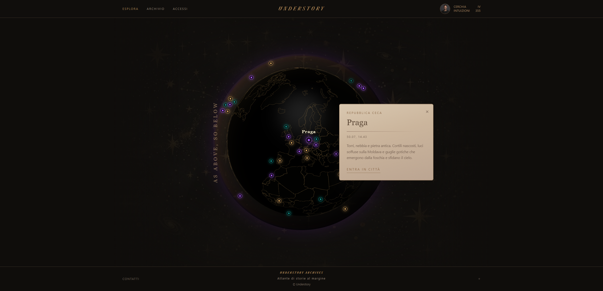
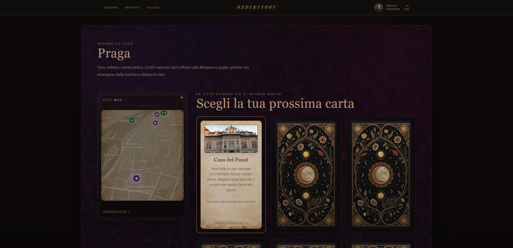
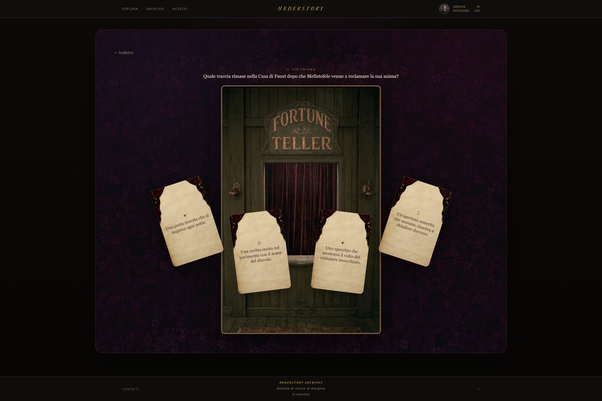
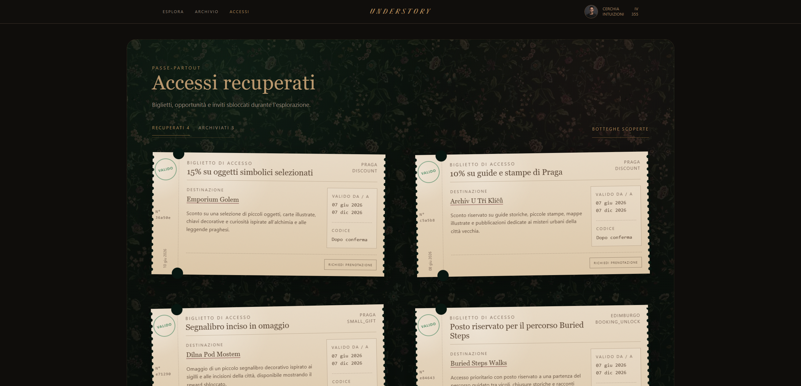
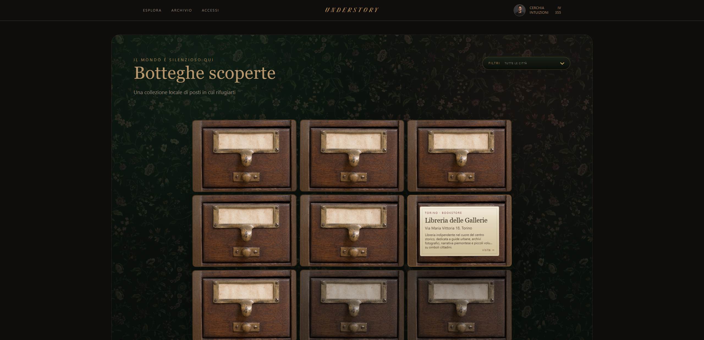
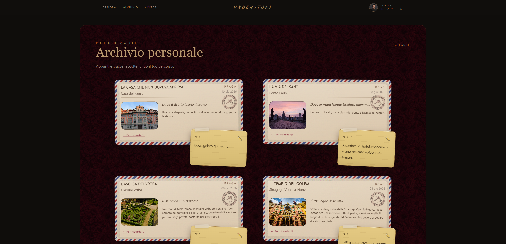
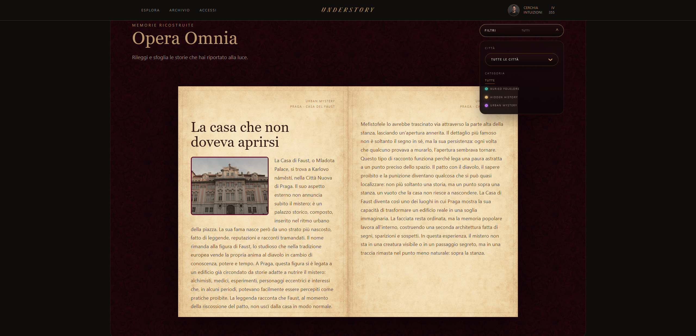

# Understory

> **Esplorare una città significa anche scoprire ciò che normalmente rimane sotto la superficie.**

🇮🇹 **Italiano**  
🇬🇧 [English version below](#english-version)

---

## Il progetto

**Understory** è una piattaforma full stack nata con l'obiettivo di rendere
l'esplorazione urbana — e, più in generale, la scoperta di un luogo —
meno passiva e più coinvolgente.

L'idea è quella di raccontare soprattutto **storie meno conosciute, curiosità
locali e piccoli dettagli** che spesso rimangono ai margini dei percorsi
turistici tradizionali, oppure di proporre luoghi già noti attraverso una
chiave di lettura differente.

A differenza delle classiche guide turistiche, che si limitano principalmente
a mostrare informazioni, Understory accompagna l'utente all'interno di
**piccole esperienze narrative e interattive**.

Ogni percorso conduce progressivamente verso una prova o una micro-sfida:
solo dopo averla completata l'utente può scoprire la storia nascosta dietro
quel luogo.

Il nome **Understory** richiama proprio questa idea: qualcosa che si trova
sotto la superficie, uno strato nascosto della città che non si mostra subito,
ma che può emergere osservando, seguendo una traccia e mettendosi in gioco.

Il progetto non nasce con l'intento di creare un videogioco, ma come
**strumento divulgativo e didattico interattivo**, con un'estetica ispirata
agli archivi editoriali e ai gabinetti delle curiosità di fine Ottocento.



---

## Valorizzazione del territorio

Understory vuole valorizzare il territorio non soltanto dal punto di vista
storico e artistico, ma anche attraverso il coinvolgimento delle
**attività locali**.

Completando determinate esplorazioni, l'utente può sbloccare ricompense come
sconti, ingressi o piccoli vantaggi offerti da realtà presenti sul territorio.

L'obiettivo è creare una forma di promozione non invasiva in cui l'attività
locale non venga percepita come una pubblicità separata dall'esperienza,
ma come una scoperta o un premio guadagnato attraverso l'esplorazione stessa.

---

## Come funziona

Dopo la registrazione, l’utente riceve un’email di conferma dell’avvenuta registrazione,
può effettuare il login e accedere alla pagina principale di esplorazione.

### 🌍 Esplorazione delle città

La landing page presenta un **globo 3D con marker interattivi** che permette
di visualizzare le città disponibili nel database.

Selezionando una città, l'utente può leggerne una breve descrizione e accedere
alla relativa pagina di dettaglio.

All'interno della città, i punti di interesse possono essere esplorati:

- attraverso le relative card;
- tramite una mappa interattiva;
- utilizzando i filtri disponibili nella legenda.



### 🧩 Esperienze e sfide

Ogni punto di interesse è associato a un'esperienza narrativa.

La prima parte accompagna progressivamente l'utente verso una sfida da
completare per poter accedere alla storia completa legata al luogo.

Le sfide sono attualmente disponibili in due modalità:

- 🧠 **Enigma:** domanda a risposta multipla;
- 📷 **Rilevamento:** upload dell'immagine di un dettaglio richiesto durante l'esplorazione.

Nel caso della modalità Rilevamento, l'immagine viene attualmente verificata
da un amministratore tramite backoffice. Una possibile evoluzione del progetto
prevede l'integrazione di un sistema basato su **AI** per automatizzarne
il riconoscimento.

Una volta completata correttamente la prova, viene mostrata la parte conclusiva
della narrazione, che contestualizza e approfondisce ciò che l'utente
ha appena scoperto.

> **È qui che la sfida diventa conoscenza.**



### 🏆 Progressione, ricompense e attività locali

Completando le esperienze, l'utente guadagna **punti esperienza** e aumenta
il proprio livello.

Alcune esplorazioni permettono inoltre di sbloccare ricompense utilizzabili
presso attività locali.

Nella sezione personale **Accessi** sono consultabili sia le ricompense ottenute,
con possibilità di prenotazione, sia le attività che le mettono a disposizione,
filtrabili per città.

<p align="center">
  
  
</p>

### 📖 Journal e Atlante

Il **Journal** raccoglie i punti di interesse visitati e permette di associare
una nota personale ai propri ricordi.

L'**Atlante** conserva invece la componente più divulgativa dell'applicazione:
le informazioni e le storie sbloccate durante le esperienze vengono raccolte
in una forma più discorsiva e consultabile anche successivamente.

<p align="center">
  
  
</p>

### 👤 Profilo utente

Dal proprio profilo l'utente può modificare i dati personali, controllare
il livello raggiunto e verificare i progressi ottenuti nelle diverse città.

---

## 💻 Frontend

Il frontend di Understory è stato sviluppato come **Single Page Application (SPA)**
con React e Vite.

L'applicazione gestisce autenticazione, esplorazione, gameplay, progressione
dell'utente, contenuti personali e backoffice, comunicando con il backend
attraverso **REST API**.

### Tecnologie utilizzate

| Tecnologia                      | Utilizzo                                       |
| ------------------------------- | ---------------------------------------------- |
| **React**                       | Componenti, pagine e gestione dell'interfaccia |
| **JavaScript**                  | Logica applicativa                             |
| **Vite**                        | Ambiente di sviluppo e build                   |
| **React Router**                | Routing e navigazione                          |
| **Redux Toolkit / React Redux** | Stato globale di autenticazione e utente       |
| **Tailwind CSS + CSS custom**   | Styling, responsive layout e identità visiva   |
| **react-globe.gl**              | Globo 3D interattivo                           |
| **Mapbox GL JS**                | Mappa interattiva dei punti di interesse       |
| **react-pageflip**              | Atlante digitale sfogliabile                   |
| **react-select**                | Select e filtri personalizzati                 |
| **Fetch API / REST API**        | Comunicazione asincrona con il backend         |

---

### 🧱 Architettura del progetto

Il frontend è organizzato separando le principali responsabilità
dell'applicazione:

```text
src/
├── api/          # comunicazione con il backend
├── components/   # componenti riutilizzabili
├── pages/        # pagine dell'applicazione
├── redux/        # store e autenticazione
├── routes/       # rotte protette e backoffice
├── style/        # styling delle diverse sezioni
├── App.jsx
└── main.jsx
```

La logica relativa alle richieste HTTP è mantenuta separata dai componenti,
così da evitare di distribuire la configurazione delle API all'interno
dell'interfaccia.

---

### 🧭 Routing, autenticazione e stato globale

La navigazione è gestita tramite **React Router** e comprende rotte pubbliche,
rotte riservate agli utenti autenticati e un'area amministrativa.

Tra le principali rotte:

```text
/
├── /explore
├── /login
├── /register
├── /cities/:cityId
├── /experiences/:experienceId
├── /journal
├── /atlas
├── /findings
├── /local-shops
├── /profile
└── /backoffice/*
```

Un componente `ProtectedRoute` controlla l'accesso alle sezioni personali e,
per il backoffice, verifica la presenza dei ruoli `ADMIN` o `SUPER_ADMIN`.

**Redux Toolkit** viene utilizzato per mantenere globalmente il token
di autenticazione e i dati dell'utente corrente.

Dopo il login, il JWT ricevuto dal backend viene salvato nel `localStorage`
e utilizzato nelle richieste agli endpoint protetti:

```http
Authorization: Bearer <token>
```

Se all'avvio dell'applicazione è già presente un token, il frontend prova
a recuperare automaticamente il profilo dell'utente e a ripristinare la sessione.

---

### 🔄 Comunicazione con il backend

Le chiamate HTTP sono organizzate nella cartella `src/api`.

```text
api/
├── apiClient.js       # configurazione comune delle richieste
├── authApi.js         # registrazione, login e profilo
├── publicApi.js       # città, punti di interesse ed esperienze
├── gameplayApi.js     # quiz e upload delle prove
├── meApi.js           # contenuti e dati personali dell'utente
└── backofficeApi.js   # operazioni amministrative
```

`apiClient.js` centralizza URL base, header, serializzazione JSON,
Bearer Token, gestione di `FormData` e controllo delle risposte HTTP.

Questa struttura mantiene separata la comunicazione con il backend
dalla logica dei componenti React.

---

### 🌍 Interazioni e componenti principali

La parte geografica utilizza due strumenti differenti:

- **react-globe.gl** nella landing page, per mostrare le città disponibili
  tramite marker interattivi su un globo 3D;
- **Mapbox GL JS** nella pagina città, per rappresentare e filtrare i punti
  di interesse sulla mappa.

Il gameplay supporta sia quiz a risposta multipla sia upload di immagini
tramite `FormData`.

L'Atlante utilizza **react-pageflip** per presentare i contenuti sbloccati
come un libro digitale sfogliabile, adattando l'impaginazione alla viewport.

---

### 🛠️ Backoffice amministrativo

Understory include anche un backoffice protetto per la gestione dei contenuti.

L'area amministrativa permette di lavorare su:

- città e punti di interesse;
- categorie ed esperienze narrative;
- quiz e prove con upload;
- submission fotografiche;
- attività locali e relative categorie;
- ricompense e prenotazioni;
- utenti e ruoli.

Le sezioni implementano operazioni CRUD e, dove necessario, funzioni aggiuntive
come pubblicazione dei contenuti, upload di immagini, approvazione delle prove
e gestione delle prenotazioni.

---

### ⚛️ Alcune scelte React

Il progetto combina stato locale e stato globale in base alla responsabilità
dei dati.

Tra gli hook maggiormente utilizzati:

- `useState` per stato locale, form e selezioni;
- `useEffect` per caricamento dati e sincronizzazione con elementi esterni;
- `useMemo` per ordinamenti, filtri e valori derivati;
- `useRef` per riferimenti a elementi DOM e istanze come globo e Mapbox.

L'interfaccia combina **Tailwind CSS** e CSS personalizzato e include
comportamenti responsive specifici per globo, mappa, Atlante e navigazione mobile.

---

### ▶️ Avvio in locale

Clonare il repository:

```bash
git clone https://github.com/Raviolz/understory_front.git
```

Entrare nella cartella:

```bash
cd understory_front
```

Installare le dipendenze:

```bash
npm install
```

Creare nella root un file `.env` con il token necessario a Mapbox:

```env
VITE_MAPBOX_TOKEN=your_mapbox_token
```

Avviare il frontend:

```bash
npm run dev
```

Il client utilizza attualmente come indirizzo base del backend:

```text
http://localhost:3001
```

Per utilizzare tutte le funzionalità è quindi necessario avviare anche
il backend di Understory.

---

### 🔗 Backend

Understory è suddiviso in due repository.

Il backend è sviluppato con **Java e Spring Boot** e gestisce autenticazione,
logica applicativa, persistenza dei dati e REST API.

**Repository backend:**  
https://github.com/Raviolz/understory_back

---

### 🚀 Sviluppi futuri

Tra le possibili evoluzioni del progetto:

- integrazione dell'AI per la verifica automatica delle prove fotografiche;
- ampliamento delle città e delle esperienze disponibili;
- introduzione di nuove tipologie di sfida;
- ampliamento della rete di attività locali e delle ricompense;
- ulteriori funzionalità di personalizzazione dell'esperienza.

---

### 👩‍💻 Autrice

**Giorgia Ragnoli**

Understory è stato ideato e sviluppato come Capstone Project conclusivo
del percorso **Full Stack Web Development**.

---

## English version

🇬🇧 **English version coming soon.**

La documentazione in inglese verrà aggiunta successivamente.
